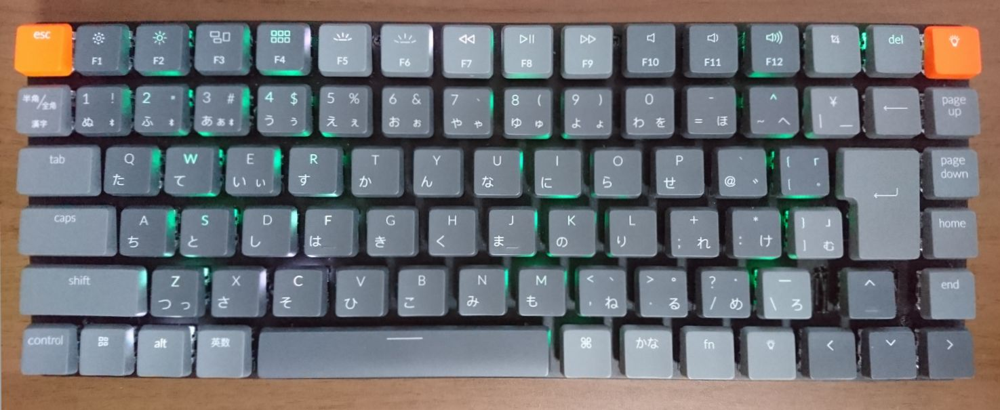

# Keychron K3

A Compact 75% Layout Ultra-Slim Wireless Mechanical keyboard.

Brought to you by: [SonixQMK](https://github.com/SonixQMK/qmk_firmware)

* Hardware Supported: SN32F248BF
* Hardware Availability: [keychron.com](https://www.keychron.com/)

## JISキーボードの QMK/VIA 対応
### JIS版について
- 本firmware には bluetooth 機能が実装されていないため、flash すると無線でのキーボード利用はできなくなります。
- 日本語配列ですべてのキーを正しく処理し、すべての LED も制御できます。LED animation は製品版とは異なりますが、製品版より多くの種類が含まれています。
- bins/keychron_k3_rgb_jis_via.bin を flash すると、VIA と REMAP でブラウザ操作でキーリマップができます。定義ファイルは、keymaps/via/info.json を使用してください。VIA、REMAPの使い方については、https://note.com/regal_orca1471/n/n7b3b47cf9e10 を参照してください。
- オリジナルの firmware は 2025年4月に探したところでは公開されていないため、一度 flash すると元には戻せません。以下の firmware でもキーボードは動作しますが、機能制限があります。
 - k3 RGB ansi : ansi版の firmware を jis キーボードに flash すると、bluetooth が使え、キーボードとしては利用できますが、jis 専用キーは使えなくなります。
 - k2 RGB jis : K2 の jis版も動作します。キー入力、bluetooth、LEDが問題なく動作します。\キーが効かず、Backspaceキーが\キーになり、カーソルキーの一部動作がおかしいです。
 どちらも、PC側のキーリマップ機能を使って制限付きで使える程度のもので、純正の firmware からは劣化した状態になります。無線でのキーボード利用が必須の方は、上記のように完全には元に戻せないため flash はしないでください。 

See the [build environment setup](https://docs.qmk.fm/#/getting_started_build_tools) and the [make instructions](https://docs.qmk.fm/#/getting_started_make_guide) for more information. Brand new to QMK? Start with our [Complete Newbs Guide](https://docs.qmk.fm/#/newbs).
